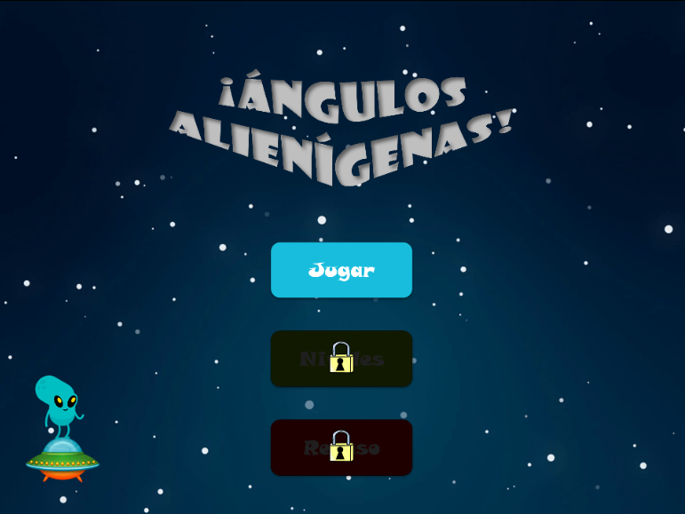
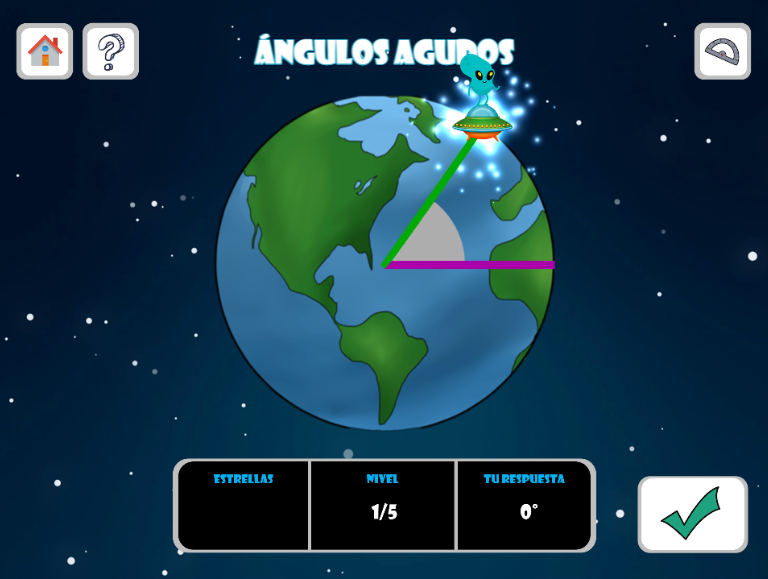

# Alien angles!
Juego web sobre ángulos, hecho con el framework Phaser.

Realizado como proyecto de servicio social para alumnos de tercer grado de primaria.
- Autor: Iván Alberto Pérez Maldonado.
- Institución: Facultad de Matemáticas, Universidad Autónoma de Yucatán.

## Jugar
Debe ser ejecutado con un servidor HTTP, ya sea el que viene con Python, `live-server` de npm, etc.

O bien, probar el juego directamente desde el siguiente link: https://alien-angles.glitch.me/.

